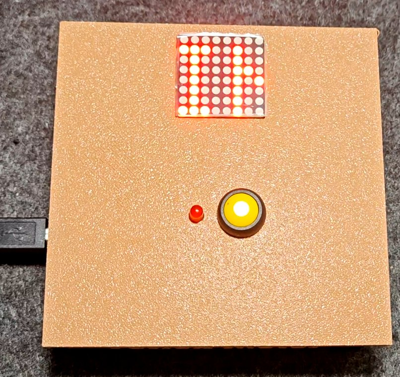
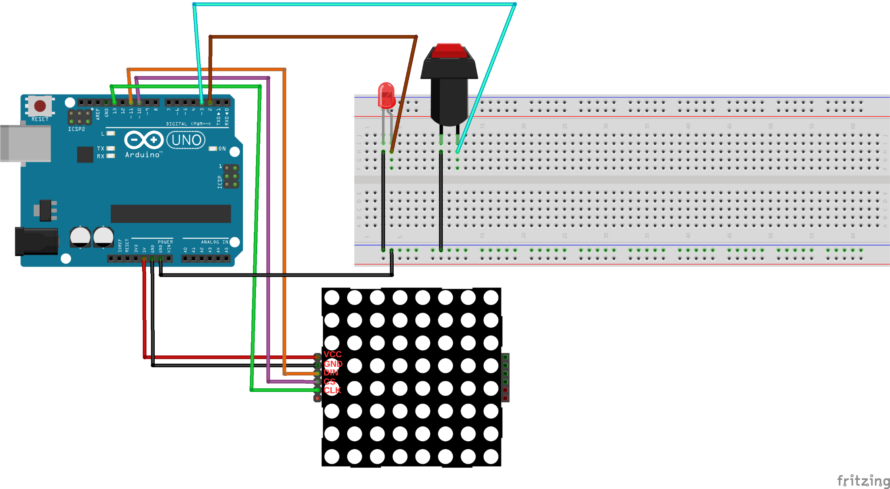

# Reflex-meter
Arduino‑based reaction‑time meter • MAX7219 LED matrix + 3D‑printed case
## Final Look


# Reflex Meter ⚡ ⏱️  
Measure your reaction time in milliseconds with an **Arduino Uno**, a **MAX7219 8×8 LED matrix** and a single push‑button.

[](https://youtu.be/XXXXXXXX)
*Full build tutorial premieres **Wednesday 20:00 (UTC+3)**—hit the bell so you don’t miss it!*

---

## Table of Contents
1. [Features](#features)  
2. [Bill of Materials](#bill-of-materials)  
3. [Wiring](#wiring)  
4. [3D Printing](#3d-printing)  
5. [Setup](#setup)  
6. [Usage](#usage)  
7. [Contributing](#contributing)  
8. [License](#license)

## Features
- **Millisecond‑accurate stopwatch** using hardware interrupts  
- Instant visual feedback (time + emoji) on the MAX7219 matrix  
- Single‑button start/stop for lightning‑fast tests  
- Snap‑fit 3D‑printed enclosure—no screws needed  
- Clean, well‑commented Arduino sketch (C++)

## Bill of Materials

| Qty | Part | Notes |
|-----|------|-------|
| 1 | Arduino Uno (clone OK) | ATmega328P |
| 1 | MAX7219 8 × 8 LED Matrix | FC‑16 module |
| 1 | 12 mm Momentary Push Button | SPST‑NO |
| 1 | 220 Ω Resistor | LED protection |
| 1 | 5 mm LED | “Ready” indicator |
| – | PLA Filament 

## Wiring
> `docs/wiring.png` will visualize these five lines:  
> **VCC → 5 V**, **GND → GND**, **DIN → D11**, **CS → D10**, **CLK → D13**


/* =============================================================
   USER CONFIGURATION & HACKING GUIDE
   -------------------------------------------------------------
   1) Pin mapping
      - DIN, CS, CLK can be reassigned to any digital pins.
      - BTN should stay on an interrupt‑capable pin (D2 or D3 on Uno).
      - The status LED can be moved; just update LED define.

   2) Display orientation
      - Uncomment  #define FLIP_180  if your MAX7219 module is
        mounted upside‑down.

   3) 5×7 font table
      - Covers ASCII 32‑126 plus Turkish chars (Ç, Ş, Ğ, Ü, Ö, İ).
      - Add new glyphs by appending 7‑byte columns at the end.

   4) 8×8 emoji icons
      - Each icon is an 8‑byte bitmap (MSB = leftmost pixel).
      - Insert new patterns in the  emoji[]  array, then point to
        them in  drawEmoji(idx).

   5) Reaction‑time ranking
      - Thresholds (150 / 300 / 450 / 650 / 850 ms) and messages
        live in the  loop()  if‑else block.
      - Tweak ranges, swap emojis or change the scroll messages
        to localize the game.

   6) Scroll speed
      -  scroll(text, delayMs);  // default delay = 85 ms per column
        Smaller value  →  faster scroll.
   Happy hacking & share your mods with #ReflexMeter!
   ============================================================= */

## 3D Printing
STLs are in `/3d-models`.  
Recommended settings: 0.20 mm layer height, 15 % infill, no supports.

## Setup
```bash
# Clone the repo
git clone https://github.com/kocyunus/reflex-meter.git

# Go to the firmware folder
cd reflex-meter/firmware

# Open the sketch in Arduino IDE (double‑click or use code ./ if you prefer VS Code)
open ReflexMeter.ino     # macOS / Linux
# veya
start ReflexMeter.ino    # Windows PowerShell/CMD

